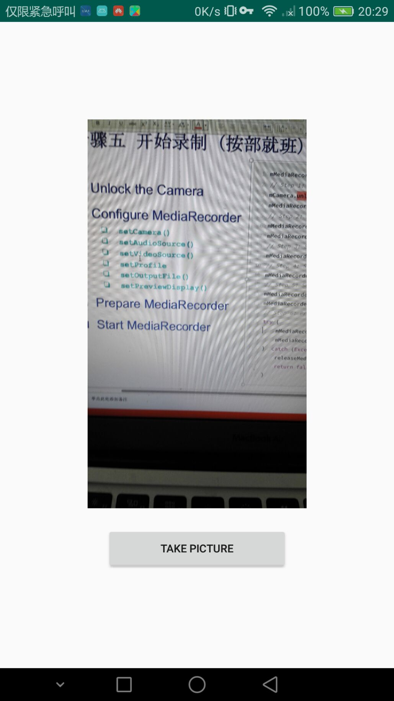
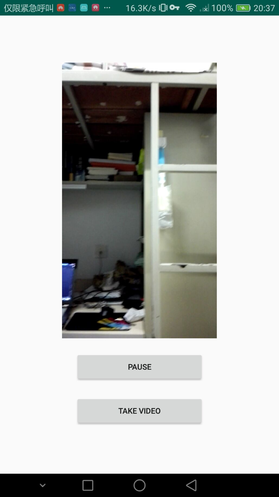
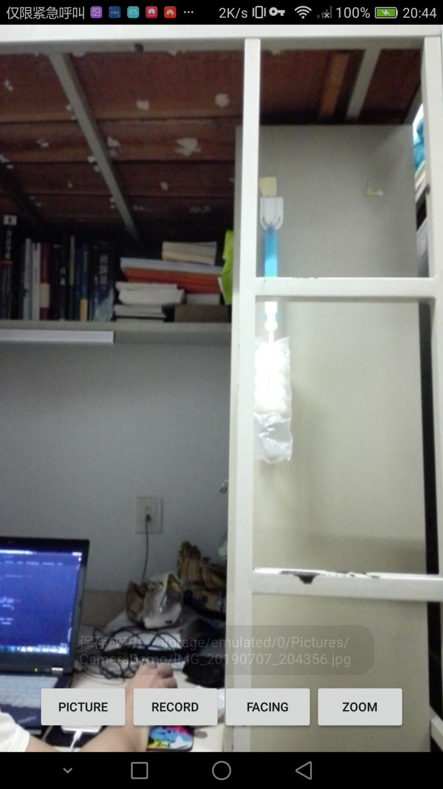
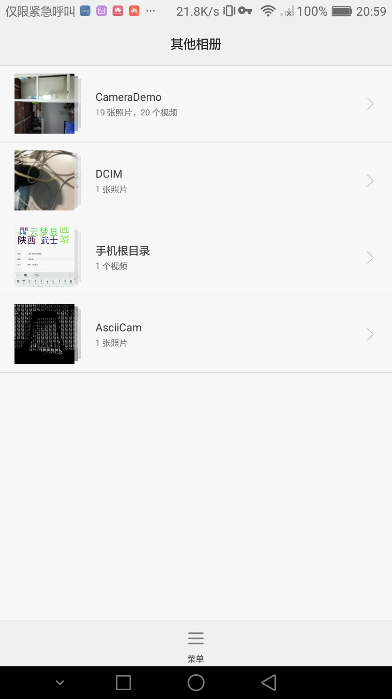

##README

####第八次个人作业：多媒体应用进阶版
####个人信息：
16071070 陈泽寅

####Demo说明
一：功能说明：

1.PPT上的要求，实现三个模块的功能。第一个模块如下

点击中间的Button就能够调用系统的相机进行拍摄，然后就能在中间的Imageview中返回我们的图片。并且在相册中也能够找到我们的图片。

2.视频播放页面,最上面的是vedioview，然后下面两个按键，点击录制按钮，就进入系统摄像头进行录制，然后把录完的视频在上方进行播放，并且点击暂停按钮就能暂停，再点击一下就能够重新继续。

3、第三个主要demo的页面如下

下方四个按钮，前两个分别是录制视频和拍照，并且存到相应的目录下。点击picture按钮之后，会向相册发起广播，告知相册去扫描相应的目录，这样就能够直接在相册中看到我们的图片了。同理Vedio也是这样。第三个按钮就是来回切换摄像头，按第四个Zoom按钮就会不断拉近摄像头直到最大就会复原。并且每次都实现自动对焦。

由于实现了广播，因此在相册中能看到我们的cameraDemo。

并且摄像头根据surfaceview的大小将显示的图片拉伸到最合适的位置，使用getOptimal函数调整Camera.Size，进行适配。

@copyright 16071070 czy